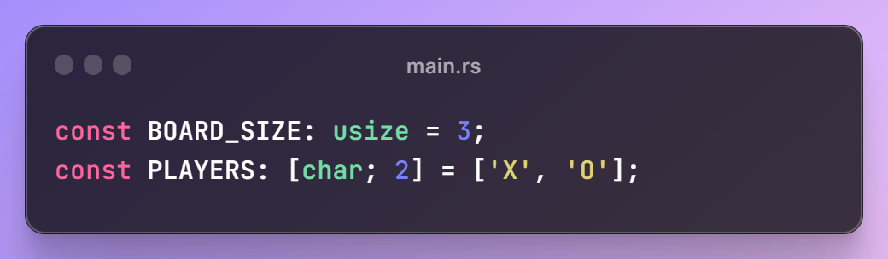
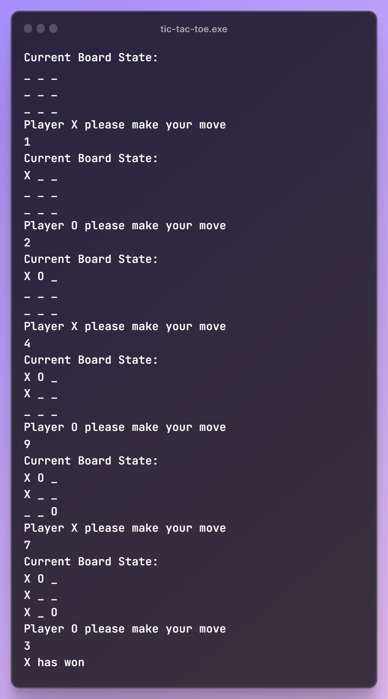

# Rust Tic Tac Toe
## Learning Rust Basics: Simple Tic Tac Toe CLI with any n*n board and any number of players.

#### Configuring the board size and players.  

#### Example game with the standard 3x3 board and two players.  
